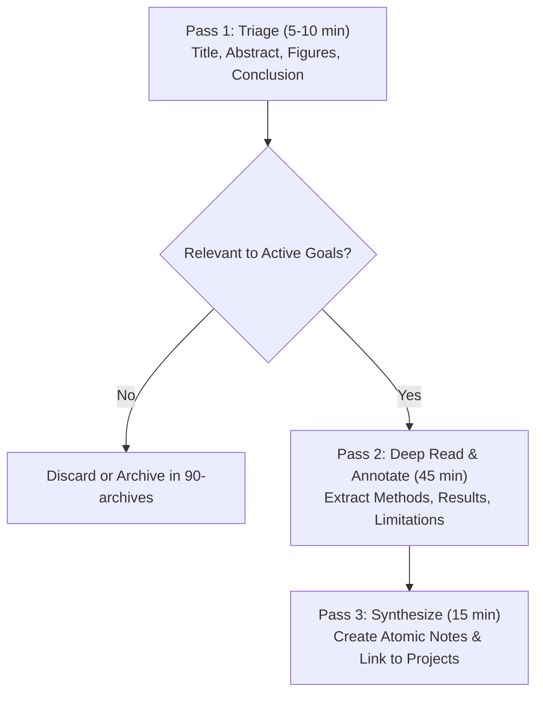

# Academic Research, Literature Review & Knowledge Synthesis Workflow

## 1. Purpose & Scope

This playbook establishes a repeatable, three-stage workflow for discovering, actively reading, and synthesizing academic papers and technical literature into evergreen knowledge notes.

---

## 2. The Three-Pass Reading Method

### Pass 1: Rapid Triage (5–10 minutes)
1. **Goal**: Determine whether the paper justifies deep attention.
2. **Procedure**:
   - Read the **Title**, **Abstract**, and **Introduction**.
   - Skim section headings and examine all **Figures and Tables**.
   - Read the **Conclusions** section.
3. **Action**: If relevant, create a literature note in `30-knowledge/` using `templates/literature-note.md` with `reading_status: in-progress`.

### Pass 2: Active Breakdown (30–60 minutes)
1. **Goal**: Grasp the core mechanics, math, and limitations without getting bogged down in line-by-line derivations.
2. **Procedure**:
   - Identify the underlying problem formulation and assumptions.
   - Trace the proposed algorithm, control law, or machine learning architecture.
   - Evaluate the experimental baselines: Were the comparisons fair? What testbed was used?
3. **Record in Literature Note**:
   - One-line executive summary.
   - Core contributions (bulleted).
   - Limitations and failure modes.

### Pass 3: Evergreen Synthesis & Linking (15 minutes)
1. **Goal**: Transfer insights into your permanent knowledge network.
2. **Procedure**:
   - Does this paper introduce a universal algorithm or concept? $\rightarrow$ Create an atomic concept note in `30-knowledge/` using `templates/concept.md`.
   - Does this paper solve a blocker in an active project? $\rightarrow$ Link it directly in `10-projects/<project>.md`.
   - Update `reading_status` in the literature note to `read`.

---

## 3. Literature Note Schema & Conventions

All literature notes must:
- Use ID pattern `LIT-YYYYMMDD-HHmmss`.
- Include publication year, venue, and DOI or URL.
- Maintain at least one outgoing wikilink to a broader conceptual note or project charter.

---

## 4. Periodic Literature Review Checklist

- [ ] **Weekly Queue Review**: Check `00-inbox/` for captured papers; move relevant ones to reading queue.
- [ ] **Synthesis Check**: Ensure notes marked `read` contain meaningful wikilinks, not just isolated summaries.
- [ ] **BibTeX Maintenance**: Store clean BibTeX entries in the note's reference section for easy citation in LaTeX.
