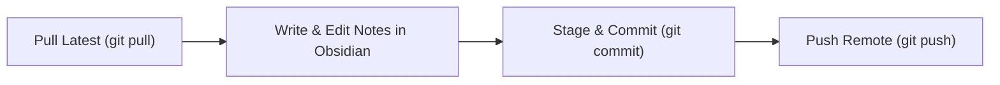

# Git Workflow, Branching & Multi-Device Sync Conventions

## 1. Purpose & Scope

This playbook establishes universal version control standards for this Second Brain repository. It is designed to balance low-friction daily note-taking across multiple devices (desktop workstation, laptop, and mobile) with durable, clean version history.

---

## 2. Core Principles

1. **`main` is the Living Trunk for Knowledge**: Unlike large-scale software engineering teams, 95% of knowledge work (daily notes, concept notes, literature summaries, meeting logs) is committed directly to `main`. You do **not** need a branch or PR to write a note.
2. **Feature Branches for Bulk Reorganizations**: Reserve branches and Pull Requests strictly for high-impact structural changes:
   - Migrating or renaming entire folder structures.
   - Running automated bulk refactors across dozens of files.
   - Upgrading scripts, CI workflows, or tooling configurations.
3. **Atomic & Conventional Commits**: Every commit should describe *what knowledge changed* using standardized commit types:
   ```text
   type(scope): description
   ```
4. **Multi-Device Sync Discipline**: Ensure smooth synchronization between desktop and mobile devices by pulling before editing and pushing when complete.
5. **Strict Asset Separation**: Text, Markdown notes, templates, and lightweight diagrams live in Git. Large media files (>10MB), heavy raw datasets, or compiled binaries must remain outside Git.

---

## 3. Commit Taxonomy

### Types

| Type | Use For | Example |
| :--- | :--- | :--- |
| `note` | New concept, literature review, or note expansion | `note(ai): add transformer attention mechanism` |
| `daily` | Daily note updates, priorities, or logs | `daily: update priorities and tasks for 2026-09-20` |
| `curate`| Processing inbox items, tagging, or linking | `curate(inbox): promote quick-capture note to 30-knowledge` |
| `feat` | New templates, playbooks, or validation scripts | `feat(templates): add thesis milestone checklist template` |
| `fix` | Broken links, schema errors, or script corrections | `fix(schema): resolve missing required tag in concept note` |
| `docs` | Documentation, README, or vault contract updates | `docs(meta): clarify naming conventions` |
| `chore`| Repository hygiene, `.gitignore`, or archiving | `chore: archive completed project files` |
| `sync` | Automated commits generated by sync scripts | `sync(vault): autosave 2026-09-20T14:30:00` |

### Standard Scopes
Use domain scopes that match the vault hierarchy:
- `inbox`, `daily`, `projects`, `areas`, `knowledge`, `decisions`, `playbooks`, `personal`, `templates`, `meta`, `ci`

---

## 4. Multi-Device Synchronization Workflow



### A. Desktop Workstation / Laptop
1. Open Obsidian. If auto-sync is not configured, run:
   ```bash
   git pull origin main
   ```
2. Edit freely in Obsidian.
3. At the end of a writing or study session, commit and push:
   ```bash
   git add -A
   git commit -m "note(controls): summarize state-space stability criteria"
   git push origin main
   ```

### B. Mobile Editing (GitSync / Obsidian Mobile)
Follow the **"Pull on Launch, Push on Exit"** discipline:
1. **Launch**: Open GitSync $\rightarrow$ Tap **Pull** (downloads latest desktop changes).
2. **Write**: Open Obsidian Mobile $\rightarrow$ create quick notes or journal entries.
3. **Exit**: Return to GitSync $\rightarrow$ Tap **Commit & Push** (uploads changes to remote).

---

## 5. Resolving Sync Merge Conflicts

If you edited notes concurrently across two devices without pulling first, a merge conflict may occur upon push.

### Step-by-Step Resolution
1. Fetch and examine the conflicting state:
   ```bash
   git status
   ```
2. Open the conflicting `.md` file in Obsidian or an editor. Look for conflict markers:
   ```markdown
   <<<<<<< HEAD
   My edits made on desktop.
   =======
   My quick notes made on mobile.
   >>>>>>> origin/main
   ```
3. Manually reconcile both thoughts, remove the markers, and save the file.
4. Stage and complete the merge commit:
   ```bash
   git add <conflicted-file>.md
   git commit -m "fix(sync): resolve concurrent edit conflict in daily note"
   git push origin main
   ```

---

## 6. AI Agent Git Guardrails

When automated agents (Hermes, Antigravity, Claude, Codex) interact with the vault:
- **No Force Pushes**: Force-pushing (`git push --force`) is strictly forbidden.
- **Atomic Commits**: Agents must create targeted commits reflecting specific tasks.
- **Diff Hygiene**: Before committing, agents must verify clean line endings and diffs (`git diff --check`).
- **No Secret Commits**: Agents must never stage or commit `.env`, private keys, or credential tokens.
