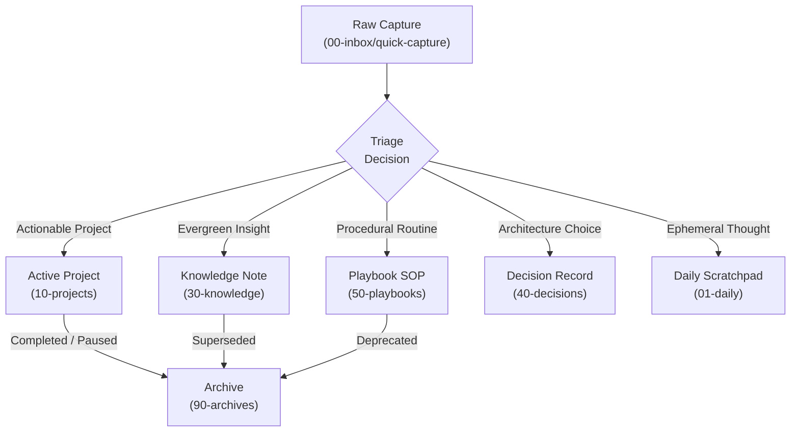

# Second Brain Vault Architecture & Scaffolding Guide

This guide details the structural design, note lifecycle transitions, and folder boundaries of this knowledge repository.

---

## 1. The Note Lifecycle

Notes flow through predictable stages as they mature from fleeting thoughts into permanent knowledge:

---

## 2. Directory Breakdown & Roles

### `00-inbox/` (Temporary Intake)
- **Role**: Zero-friction destination for fleeting thoughts, mobile captures, audio note transcripts, and AI drafts.
- **Subdirectories**:
  - `quick-capture/`: Unsorted raw thoughts and links.
  - `agent-drafts/`: Drafts generated by background AI agents awaiting review.
- **Discipline**: Aim for regular inbox triage. Notes in `00-inbox/` should be processed and either retained with `status: processed`, moved to an appropriate durable destination, or moved to `.trash/` if intentionally discarded. Never hard-delete automatically.

### `01-daily/` (Chronological Daily Journals)
- **Role**: Daily time-blocking, task tracking, habit logging, and reflections.
- **Naming**: `YYYY-MM-DD.md` (e.g. `2026-09-20.md`).
- **Template**: Populated automatically by the Daily Notes plugin using `templates/daily.md`.

### `10-projects/` (Active Outcomes)
- **Role**: Time-bounded initiatives with clear endpoints and defined deliverables.
- **Template**: `templates/project.md` (charter, milestones, task breakdown, activity log).
- **Rule**: When all milestones are reached, move the project note to `90-archives/`.

### `20-areas/` (Ongoing Spheres of Responsibility)
- **Role**: Long-term domains requiring continuous maintenance without a definitive completion date (e.g., `career.md`, `health-fitness.md`, `financial-planning.md`).
- **Template**: `templates/area.md`.

### `30-knowledge/` (Evergreen Knowledge Base)
- **Role**: The core cognitive asset of the vault. Contains atomic concept notes, scientific formulations, algorithms, and literature breakdowns.
- **Templates**: `templates/concept.md`, `templates/literature-note.md`, `templates/learning-note.md`, `templates/experiment.md`.

### `40-decisions/` (Architecture Decision Records)
- **Role**: Historical records documenting why specific architectural, technical, or strategic choices were made.
- **Template**: `templates/decision.md`.

### `50-playbooks/` (Standard Operating Procedures)
- **Role**: Verified, step-by-step checklists and operational protocols that guarantee repeatable execution.
- **Template**: `templates/playbook.md`.

### `60-personal/` (Private Life Infrastructure)
- **Role**: Long-term personal infrastructure, budget summaries, life goals, and personal equipment logs.
- **Privacy Warning**: If you share your repository or make it public, ensure sensitive notes in `60-personal/` are excluded.

### `90-archives/` (Historical Reference)
- **Role**: Cold storage for completed projects, superseded concepts, inactive areas, or obsolete playbooks.
- **Rule**: Never delete valuable historical context; move it to `90-archives/` to preserve backlink integrity.

### `assets/` (Attachments & Media)
- **Role**: Storage for embedded diagrams, images, and schematics (<10MB).
- **Rule**: No large video recordings, raw sensor datasets, or binaries. Standard Git tracking only.

---

## 3. Core Scaffolding Specifications
- **Wikilinks**: Always connect related notes via `[[Note Name]]` to build an associative knowledge graph.
- **Frontmatter**: Every file must contain YAML metadata conforming to `meta/metadata-schema.md`.
- **Renaming**: Keep `"alwaysUpdateLinks": true` enabled in `.obsidian/app.json` so Obsidian automatically updates all incoming links when files are renamed or moved.
